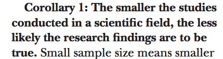
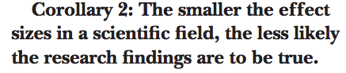
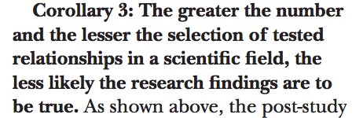
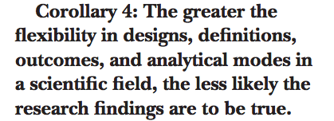
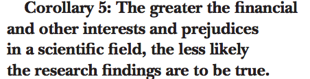
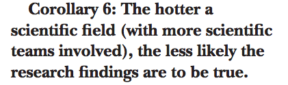

% PSYCH 214 - functional MRI methods
% Matthew Brett, JB Poline, Mark D'Esposito
% August 29 2016

[//]: # (
pandoc -t beamer -s day_00_slides.md -o day_00_slides.pdf
OR
make day_00-slides
)

# The plan

1. functional MRI methods;
2. how to work with functional MRI data.

# The plan again

1. functional MRI methods;
2. how to work with functional MRI data.

# Why "how to work with"?

Functional MRI is really hard to learn and teach:

* neuroanatomy;
* neurophysiology;
* data analysis;
* physics;
* signal processing;
* image processing;
* linear algebra;
* statistics;

# Current practice

* learn some of some of the areas;
* pick the rest up as you go;
* "makes sense" epistemology;
* wing it.

# So, what's the problem?

* like science, but not science;
* many mistakes;
* inefficient;
* hard to collaborate.

# Like science, but not science

Richard Feynman, What is Science? (1969)

> Science alone of all the subjects contains within itself the lesson of the
> danger of belief in the infallibility of the greatest teachers in the
> preceding generation... Learn from science that you must doubt the experts
> ...
> Science is the belief in the ignorance of experts

# Take no-one's word for it

\centerline{\includegraphics[height=2.5in]{images/nullius_in_verba.jpg}}

(by kladcat under [CC BY 2.0](http://creativecommons.org/licenses/by/2.0), via
Wikimedia Commons)

# Ubiquity of error

> The scientific method's central motivation is the ubiquity of error - the
> awareness that mistakes and self-delusion can creep in absolutely anywhere
> and that the scientist's effort is primarily expended in recognizing and
> rooting out error."

Donoho, David L, et al. 2009. Reproducible research in computational
harmonic analysis. *Computing in Science & Engineering* 11, 8--18.

# Science vs advertising

> An article about computational science in a scientific publication is not
> the scholarship itself, it is merely advertising of the scholarship.  The
> actual scholarship is the complete software development environment and the
> complete set of instructions which generated the figures"

[The wavelab front page](http://statweb.stanford.edu/~wavelab)

# Understanding by building

"What I cannot create, I do not understand"

[Richard Feynman](http://en.wikiquote.org/wiki/Richard_Feynman)

# Many mistakes

\ 

* http://dx.doi.org/10.1371/journal.pmed.0020124
* http://matthew-brett.github.io/teaching/ioannidis_2005.html

# When most research findings are false 1

\ 

# When most research findings are false 2

\ 

# When most research findings are false 3

\ 

# When most research findings are false 4

\ 

# When most research findings are false 5

\ 

# When most research findings are false 6

\ 

# Inefficient

* Simple comes from Latin *simplex* - one fold.  The opposite of *complex* -
  Latin for twisted together.
* Easy comes from old French *aiser* to Latin *adjacens* "lying close by".

Easy is what you are familiar with, not far from something you already know.
Simple is when you have succeeded in breaking the problem into separate ideas.

See: http://www.infoq.com/presentations/Simple-Made-Easy

Also: Oxford dictionary of Word origins edited by Julia Cresswell.

# Choose simple over easy

\centerline{\includegraphics[width=4in]{images/simple_easy_velocity.png}}

# The plan returns

1. functional MRI methods;
2. how to work with functional MRI data.

# Strategy

We start with:

* Python;
* correct coding;
* version control.

We'll use that as a foundation for teaching imaging analysis.

We'll emphasize:

* collaboration;
* transparency;
* learning from your peers.

# We intend

The "Berkeley Way"

https://en.wikipedia.org/wiki/The_Toyota_Way

# Where we're going

See: https://bic-berkeley.github.io/psych-214-fall-2016/projects.html

# Logistics

See: https://bic-berkeley.github.io/psych-214-fall-2016/logistics.html

# End of talk

Start of work ...
