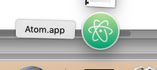

###################
Installation on Mac
###################

.. _terminal.app:

************
Terminal.app
************

We'll be typing at the "terminal" prompt often during the class.  In OSX, the
program giving the terminal prompt is ``Terminal.app``.  It comes installed
with OSX.

Press the Command key and the spacebar at the same time to open the Spotlight
search box.  Type "terminal" and press return to open Terminal.app.  You
should get a terminal window.  Consider pinning Terminal.app to your dock by
right-clicking on the Terminal icon in the dock, chose "Options" and "Keep in
dock".

********************
The Atom text editor
********************

Download the Atom installer for Mac from the https://atom.io.  Go to your
Downloads folder and click on the Downloaded ``atom-mac.zip`` file.  This will
unzip the files into your Download folder.  You should now see an Atom icon
for the ``Atom.app`` application folder in your Downloads, maybe something
like this:

Open a new Finder window, navigate to the Applications folder, and drag the
``Atom.app`` folder to the Applications folder.

Double-click on the Atom folder icon in the Applications folder to open Atom
for the first time.  At the dialog "Atom.app is an application downloaded from
the Internet. Are you sure you want to open it?", select Open.  Atom should
now be installed.

*******************
Python and packages
*******************

A standard way
==============

This is the way that I (MB) installed on my Mac laptop, so it will be easiest
for us to support you if you do the same thing.

Install homebrew
----------------

Homebrew_ is "The missing package manager for OSX".  It is a system for
installing many open-source software packages on OSX.  I recommend any serious
Mac user install homebrew.

To install homebrew, follow the instructions on the `homebrew home page
<homebrew>`_.

Install Python 3
----------------

In :ref:`terminal.app`, type::

    brew install python3

Confirm that you have python 3 and the Python3 package installer ``pip3`` on
the path with these commands and their expected outputs::

    $ which python3
    /usr/local/bin/python3
    $ which pip3
    /usr/local/bin/pip3

Set up user installs
--------------------

The standard correct way to use ``pip`` (and, in our case) ``pip3`` is to
install packages into your user's environment, rather than into the main
system that is shared across users.  This is called a pip "user" install.

If you have Python 3.5, a user install on OSX will put the package files into
a set of directories starting with ``~/Library/Python/3.5``, where ``~``
refers to your home directory.

Packages may have command line programs.  These will be installed to
``~/Library/Python/3.5/bin``.  You need to put this directory on your
``PATH``.

.. include:: links_names.inc
